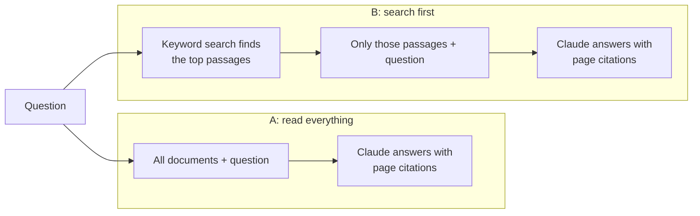

# Ask Our Documents: an AI assistant for company documents

An assistant that answers questions from a company's own documents, cites the page each answer comes from, and says so when the documents don't cover the question. Tested on two document sets, with two designs, to answer the question businesses actually ask: **which approach should we use, and what will it cost?**

- **100% correct on small company documents** (35 / 35 questions, 10 pages), including rules that were later changed by a memo
- **100% correct on 467 pages of real Irish sustainability reports** (19 / 19) when the assistant reads everything, at about 23 cents per question
- **Keyword search is far cheaper on the large reports but only as good as what it retrieves**: 9 / 19 correct with 5 passages, 17 / 19 with 20, and its misses were "I couldn't find it", not invented answers

<!-- Demo: add the recording as docs/demo.gif and uncomment the next line -->
<!--  -->

## The business problem

Staff waste time searching handbooks, policies and reports, or asking a manager the same questions again. An AI assistant can answer instantly, but only if people can trust it. So every answer must:

1. come only from the company's documents, with the page cited, so it can be checked;
2. give the **current** rule when a later document changed it;
3. say "I don't know" when the documents don't cover the question, instead of guessing.

## Two designs compared



- **A: read everything.** Every document goes to Claude with every question. Prompt caching means the documents are only paid for in full once; after that they cost about a twentieth as much per question.
- **B: search first.** The documents are split into short passages; keyword search (TF-IDF) picks the most relevant ones, and only those go to Claude.

Both use Claude's built-in citations, so every statement links to a document and page.

## Results

Each answer was graded against a reference answer by a separate Claude call ("LLM as judge"), and citations were checked against the pages that actually contain the answer. Scored by `evaluate.py`.

### Small document set: Kildare Craft Coffee (5 documents, 10 pages)

A fictional café's staff handbook, food safety procedures, purchasing policy, equipment guide and a January 2026 memo that changes several handbook rules. 35 questions: lookups, tables, rules changed by the memo, questions that need two documents, and 4 questions the documents can't answer.

| | A: read everything | B: search first |
| --- | --- | --- |
| Correct | **35 / 35** | 33 / 35 |
| Citation on the right page | **31 / 31** | 29 / 31 |
| Time per question | 5.0 s | 4.4 s |
| Cost per question | **$0.010** | $0.017 |

Reading everything was more accurate **and** cheaper: once cached, 10 pages cost almost nothing to resend. Keyword search missed "What breaks do I get on a 7-hour shift?" because the handbook says "more than 6 hours".

### Large document set: three Irish sustainability reports (467 pages)

Public reports from three industries: Kerry Group Annual Report 2025 (290 pages), Ryanair FY26 Sustainability Statement (119 pages) and Bank of Ireland Sustainability Report 2024 (58 pages). 19 questions on emissions targets, sustainable aviation fuel, sustainable finance, people and financial targets, including two-report comparisons and 2 questions the reports can't answer (one about Glanbia, which appears in the Kerry report only as a pay benchmark).

| | A: read everything | B: search, 5 passages | B: search, 20 passages |
| --- | --- | --- | --- |
| Correct | **19 / 19** | 9 / 19 | 17 / 19 |
| Citation on the right page | **17 / 17** | 9 / 17 | 15 / 17 |
| Time per question | 7.9 s | 4.5 s | 4.3 s |
| Cost per question | $0.23 ($2.45 for the first, then about $0.10) | **$0.019** | $0.044 |

**Reading everything stayed perfect at 467 pages**, and was faster than expected (about 8 seconds per question), but costs about 12 times more per question than 5-passage search.

**Simply retrieving more passages closed most of the gap.** Going from 5 to 20 passages took search from 9 / 19 to 17 / 19 correct, at $0.044 per question: about a fifth of read-everything's average cost, or under half its cost once the reports are cached. Both remaining misses were "I couldn't find it" answers, not wrong numbers.

**See real answers:** [docs/example-answers.md](docs/example-answers.md) shows seven questions with the assistant's unedited answers, including the outdated-rule trap, "I don't know" answers, and where keyword search failed.

### What this means for a client

| Situation | Recommendation |
| --- | --- |
| Handbooks, policies, procedures (tens of pages) | **Read everything.** Most accurate and cheapest. No search to build or maintain. |
| Large document sets (hundreds of pages) | Reading everything stays accurate but costs roughly 10–25 cents per question. Search with enough passages (20 here) gets close at a fraction of the cost; the choice depends on question volume and how costly a missed answer is. Better search (for example semantic search) is the next thing to test. |
| Any size | Test against real questions with known answers before going live, as done here. |

**What the failures looked like.** In 9 of its 10 misses on the large set, search-first said it couldn't find the answer, rather than inventing one. That is the safer way to fail, but users could wrongly conclude the report doesn't say. Only one answer was muddled ("12.5% of flights" instead of 12.5% of fuel).

**Limitations.** The question sets are small (35 and 19), so the results show clear trends rather than precise percentages. The café documents are synthetic and written by the same person who wrote the questions.

## Run it yourself

Requires Python 3.10+ and an [Anthropic API key](https://console.anthropic.com).

```
py -m venv .venv
.venv\Scripts\activate
pip install -r requirements.txt
copy .env.example .env              # then add your API key
py download_esg_reports.py          # optional: the three public sustainability reports
```

| Command | What it does |
| --- | --- |
| `streamlit run app.py` | Chat page; switch between the café documents and the sustainability reports, and between designs |
| `py assistant.py "What discount do staff get?"` | Ask both designs one question from the command line |
| `py evaluate.py` | Score both designs on the 35 café questions (about $1.30) |
| `py evaluate.py --set esg` | Score both designs on the 19 ESG questions (about $5) |
| `py evaluate.py --set esg --design B --top-k 20` | Search design with 20 passages |
| `py watch_progress.py` | Live progress bar for a running evaluation |

## Files

| File | Purpose |
| --- | --- |
| `assistant.py` | Both designs: full-context (PDF or page text, cached) and keyword search, with page citations |
| `app.py` | Streamlit chat page |
| `evaluate.py` | Runs the questions, grades answers with an LLM judge, checks citations, reports accuracy, time and cost |
| `questions.json`, `esg_questions.json` | Test questions with reference answers and where the answer is |
| `source/*.md`, `build_documents.py`, `documents/` | The café documents, written in Markdown and built into paginated PDFs |
| `download_esg_reports.py` | Downloads the public reports (not stored in this repository) |

**Built with:** Python, the Anthropic API (Claude Opus 5.5, citations, prompt caching), scikit-learn (TF-IDF search), Streamlit, pypdf, reportlab.
